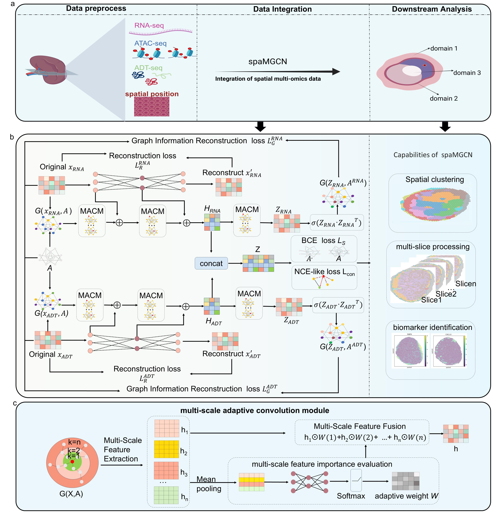

# Overview
This is the official repository for spaMGCN, which is used to identify spatial domains from spatial multi-omics data, particularly for cases where discrete distributed spots belong to the same spatial domain.Our code is based on the paper "Multi-scale Graph Clustering Network."

## Requirements
You'll need to install the following packages in order to run the codes.
* python==3.8
* torch>=1.8.0
* cudnn>=10.2
* numpy==1.22.3
* scanpy==1.9.1
* anndata==0.8.0
* rpy2==3.4.1
* pandas==1.4.2
* scipy==1.8.1
* scikit-learn==1.1.1
* scikit-misc==0.2.0
* tqdm==4.64.0
* matplotlib==3.4.2
* R==4.0.3

## Tutorial
For the step-by-step tutorial, please refer to:
[spaMGCN-tutorials/](https://github.com/hongfeiZhang-source/spaMGCN/blob/master/MGCN-main/test%20%20MoNi.ipynb)

## Benchmarking and notebooks
In this study, we conducted benchmarking of spaMGCN against the latest methods—SpatialGlue, SSGATE, GraphST, GAAEST, SpaGIC, MISO and scMDC—using different tests with default parameters. SpatialGlue, MISO, SSGATE, GraphST, GAAEST and SpaGIC are spatial domain identification methods, while scMDC is a single-cell multi-omics clustering method. 

